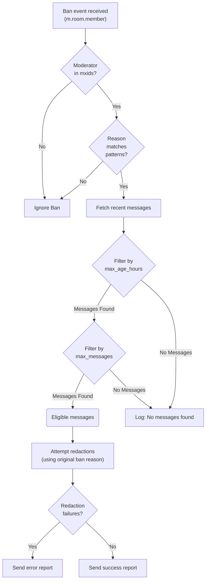

# Redactor Maubot Plugin for Matrix

`maubot-redactor` is a [Maubot](https://github.com/maubot/maubot) plugin for Matrix that helps
automate moderation by redacting messages from users who are banned for specific reasons by
designated moderators or bots.

## Features

- **Ban Monitoring**: Watches for user ban events (`m.room.member`) within Matrix rooms.
- **Moderator Matching**: Checks if the ban was issued by a moderator MXID listed in the
  configuration (case-sensitive match).
- **Reason Matching**: Checks if the ban reason matches configured regular expression patterns
  (case-insensitive match).
- **Message Redaction**: Automatically redacts a configurable number of recent messages from the
  banned user if both moderator and reason match.
- **Configurable Limits**: Control the maximum number and age of messages to redact.
- **Error Reporting**: Option to report processing errors to a designated moderation room.
- **Redaction Reporting**: Option to report successful redactions to a designated moderation room.

## Quick Start

1. **Install the plugin** (choose one method):
    - Download the `.mbp` file from the [releases page](https://github.com/tcpipuk/maubot-redactor/releases).
    - Build from source:

        ```bash
        git clone https://github.com/tcpipuk/maubot-redactor
        cd maubot-redactor
        zip -r maubot-redactor.mbp redactor/ maubot.yaml base-config.yaml
        ```

2. **Upload and Configure**:
    - Upload the `maubot-redactor.mbp` file through the Maubot admin interface.
    - Configure the settings via the Maubot UI (see Configuration Guide below).
    - Enable the plugin instance in the desired rooms where moderation should occur.

## Configuration Guide

Configure the plugin via the Maubot admin interface after uploading the instance. The settings below
are derived from `base-config.yaml`.

```yaml
# Settings related to message redaction
redaction:
  # Maximum number of recent messages to check and potentially redact per matched ban.
  # Set to null or omit to disable the message count limit (checks server's default limit).
  max_messages: 50

  # Maximum age of messages (in hours) to check and potentially redact.
  # Only messages sent within this timeframe before the ban event are considered.
  # Set to null or omit to disable the time limit.
  max_age_hours: 24 # e.g. 24 hours = 1 day

  # List of moderator MXIDs (full Matrix User IDs) whose bans should trigger redactions.
  # Bans from other users are ignored. Matching is CASE-SENSITIVE.
  # Example: ["@moderator1:example.org", "@admin:example.org"]
  mxids: []

  # List of regex patterns to match against the ban reason.
  # If a ban is issued by a moderator in 'mxids' AND the reason matches
  # ANY pattern in this list, redaction will occur.
  # If this list is empty, ANY reason (or no reason) from a listed moderator will match.
  # Matching is ALWAYS case-insensitive. Invalid regex patterns are logged at startup and ignored.
  # Example: ["^spam$", "unwanted advertising", "rule violation \d+"]
  reasons: []

# Settings related to reporting bot actions
reporting:
  # Room ID or Alias where the bot should send reports (successful redactions, errors).
  # Using the Room ID (e.g. "!roomid:server") is generally more reliable than an alias.
  # Leave null or omit for no reporting. If a room is specified, both successful
  # redactions and processing errors will be reported there.
  room: null

  # Optional: List of Matrix servers used for constructing matrix.to links in reports.
  # Helps ensure links are accessible from various clients/servers.
  # Example: ["matrix.org", "yourserver.com"]
  vias:
    - matrix.org

```

> **Tip**: Using room IDs (like `!roomid:server`) is generally more reliable and efficient than
> aliases (like `#room:server`) for the `reporting.room` setting, as the bot resolves aliases to IDs
> internally.

## Usage Example

The following flowchart and summary illustrate the entire logic the bot follows:



## Contributing

Contributions are welcome! Please feel free to open an issue or submit a pull request on GitHub.

## Licence

This project is licensed under the AGPLv3 Licence. See the [LICENCE](LICENCE) file for details.
